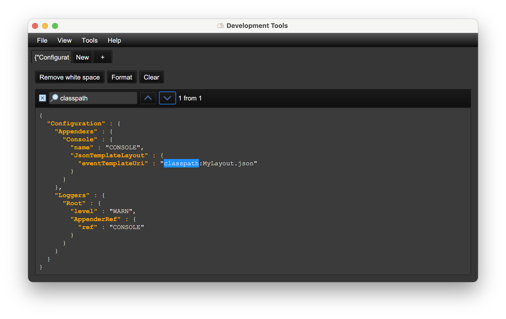
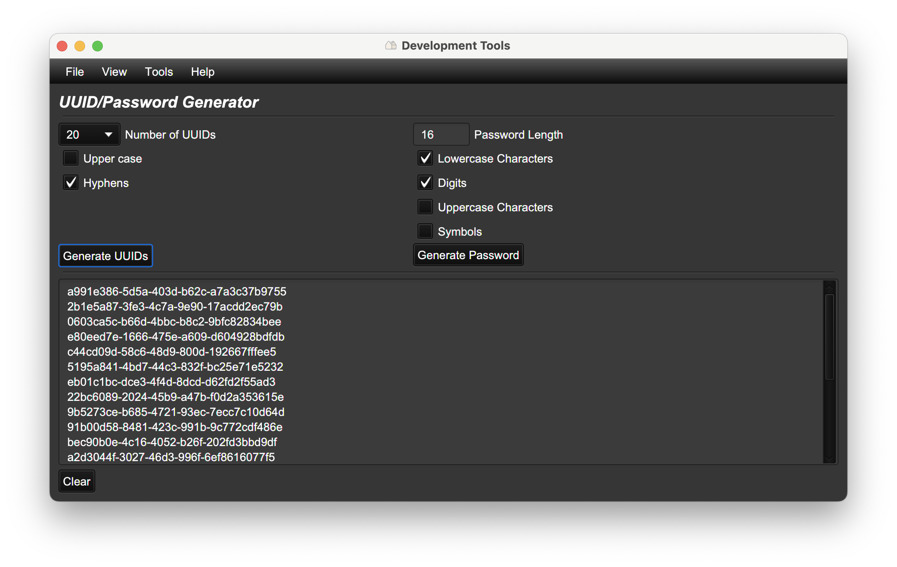
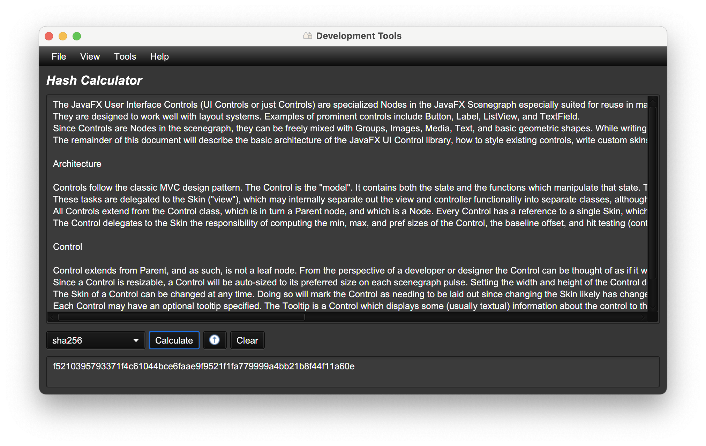
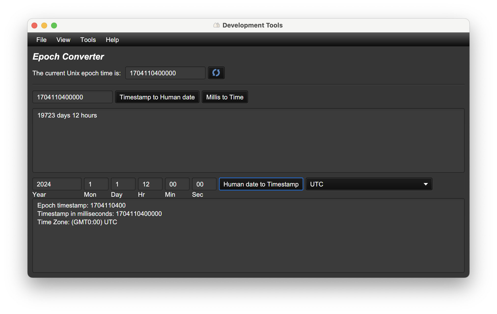
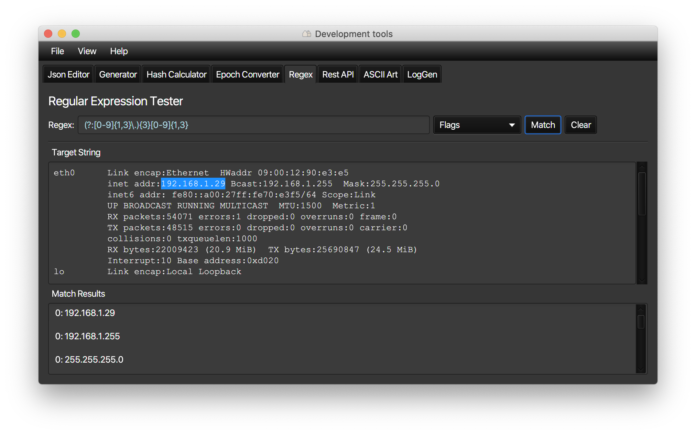
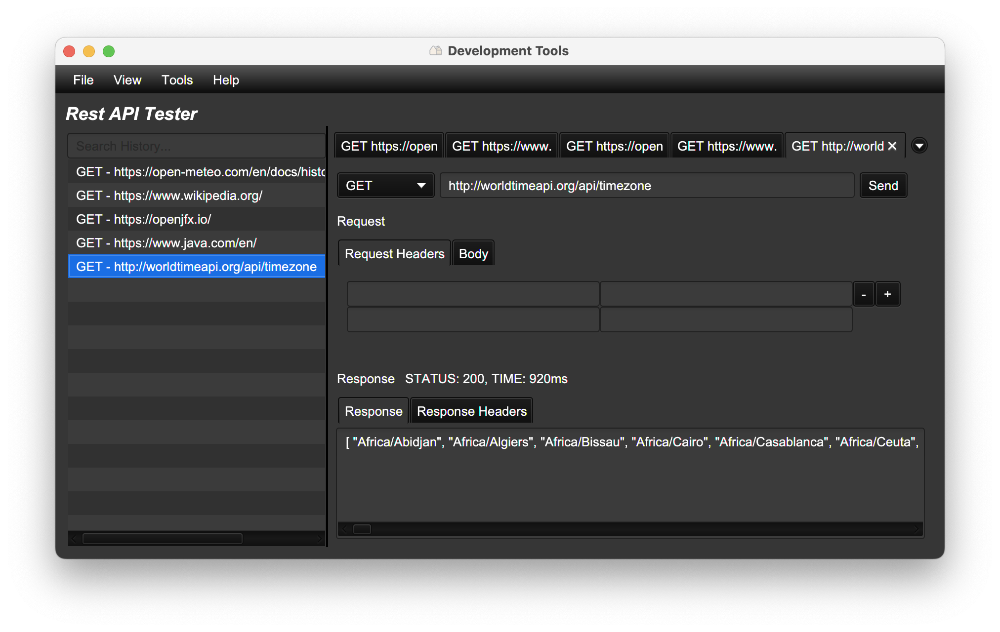
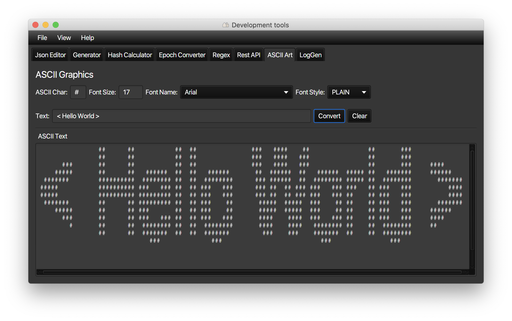
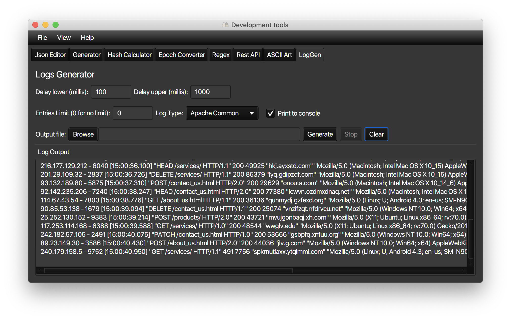

# dev-tools 

Widely used software developer tools in a single application.
* [Json Editor](#json_editor)
* [UUID/Password Generator](#generator)
* [Hash Calculator](#hash_calculator)
* [Epoch Converter](#epoch_converter)
* [Regular Expression Tester](#regex)
* [Rest API Tester](#rest_api)
* [ASCII Graphics](#ascii)
* [Logs Generator](#logs)

## Installation
* `dev-tools` is a [JavaFX](https://openjfx.io/) Maven application.
Build an executable jar from the source.
```
mvn clean package -U
```

* Build a native application using the [GluonFX Maven plugin](https://github.com/gluonhq/gluonfx-maven-plugin).
[GraalVM](https://www.graalvm.org/) installation is required.
```
mvn clean gluonfx:build
```

* Download a build from the [releases](https://github.com/reugn/dev-tools/releases).

## Prerequisites
* Java 11 (JavaFX is not a part of Java SDK as of JDK 11).

## Features
* Dark/Light mode.

## Tools List

<a name="json_editor"/>

### Json Editor
* JSON pretty print with highlighting.
* JSON validation.
* Search Bar (Ctrl+F).



<a name="generator"/>

### UUID/Password Generator
* UUID Generator.
* Password Generator.



<a name="hash_calculator"/>

### Hash Calculator
* Hash functions.
* URL Encode/Decode.
* Base64 Encode/Decode.



<a name="epoch_converter"/>

### Epoch Converter
* Current Unix epoch time.
* Timestamp to human date.
* Human date to timestamp.



<a name="regex"/>

### Regular Expression Tester
* Regex flags.
* Capturing groups.



<a name="rest_api"/>

### Rest API Tester
* Rest API testing client.
* Export/import HTTP request history.



<a name="ascii"/>

### ASCII Graphics
* Convert text to ASCII art.



<a name="logs"/>

### Logs Generator
* Generate fake log workloads using a specified format.
* Write to console.
* Write to file.



## Contributing
If you find this project useful and want to contribute, please open an issue or create a PR.

## License
Licensed under the Apache 2.0 License.
