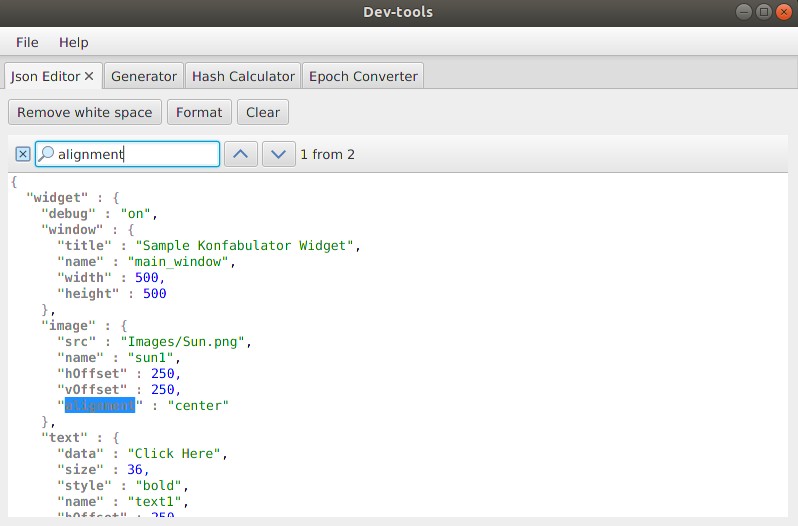
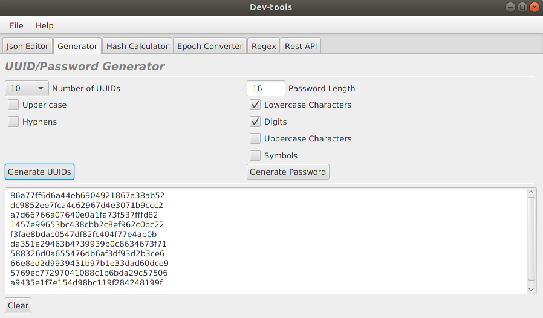
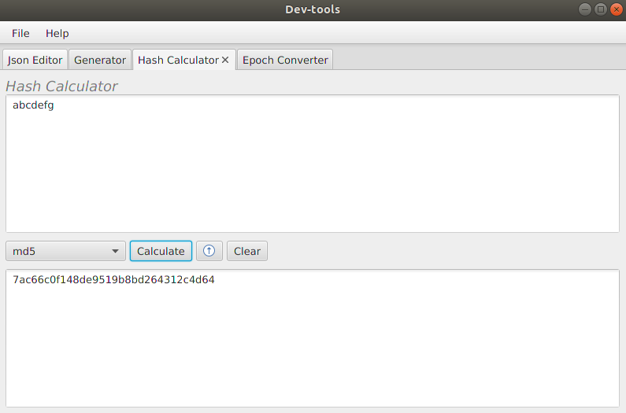
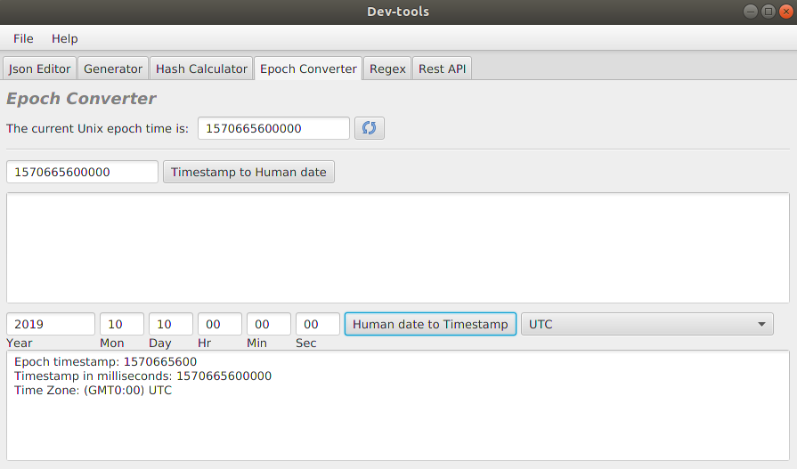

# dev-tools
Common development tools in one app

## Installation
This is a Maven JavaFX application.  
Build it from source:
```java
mvn assembly:assembly
```
or download the latest release.

***JavaFx is not a part of Java SDK as of JDK 11.***

## Tools List

### Json Editor
* Json Pretty Print with Highlighting
* Json Validation
* Search Bar (Ctrl+F)



### Generator
* UUID Generator
* Password Generator



### Hash Calculator
* Hash Functions
* URL Encode/Decode
* Base64 Encode/Decode



### Epoch Converter
* Current Unix Epoch Time
* Timestamp to Human Date
* Human Date to Timestamp



## Contributing
If you find this project useful and want to contribute, please open an issue or create a PR.

## License
Licensed under the Apache 2.0 License.
