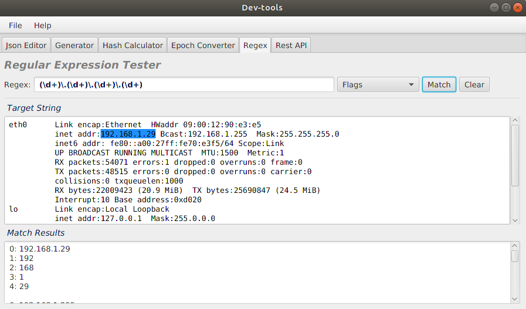
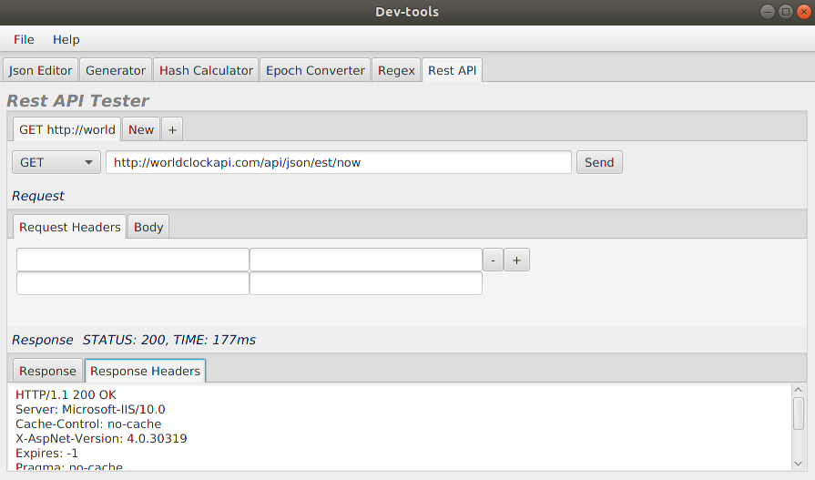
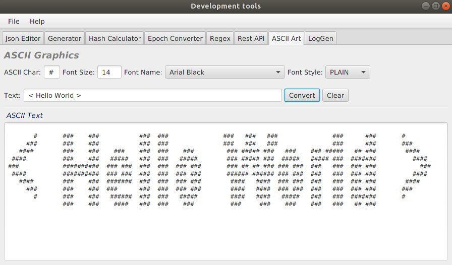
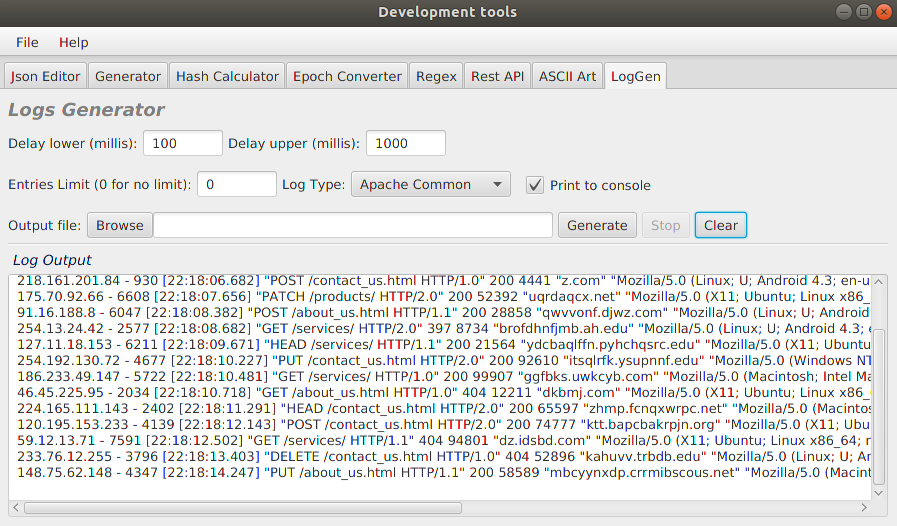

# dev-tools
Common development tools in one app.
* [Json Editor](#json_editor)
* [UUID/Password Generator](#generator)
* [Hash Calculator](#hash_calculator)
* [Epoch Converter](#epoch_converter)
* [Regular Expression Tester](#regex)
* [Rest API Tester](#rest_api)
* [ASCII Graphics](#ascii)
* [Logs Generator](#logs)

## Installation
This is a Maven JavaFX application.  
Build it from source:
```java
mvn assembly:assembly
```
or download the latest release.

***JavaFx is not a part of Java SDK as of JDK 11.***

## Tools List

<a name="json_editor"/>

### Json Editor
* Json Pretty Print with Highlighting
* Json Validation
* Search Bar (Ctrl+F)


<a name="generator"/>

### UUID/Password Generator
* UUID Generator
* Password Generator


<a name="hash_calculator"/>

### Hash Calculator
* Hash Functions
* URL Encode/Decode
* Base64 Encode/Decode


<a name="epoch_converter"/>

### Epoch Converter
* Current Unix Epoch Time
* Timestamp to Human Date
* Human Date to Timestamp


<a name="regex"/>

### Regular Expression Tester
* Regex Flags
* Capturing Groups



<a name="rest_api"/>

### Rest API Tester
* Rest API Testing Client



<a name="ascii"/>

### ASCII Graphics
* Convert text to ASCII



<a name="logs"/>

### Logs Generator
* Generate log using given format and fake data
* Write to console
* Write to file



## Contributing
If you find this project useful and want to contribute, please open an issue or create a PR.

## License
Licensed under the Apache 2.0 License.
